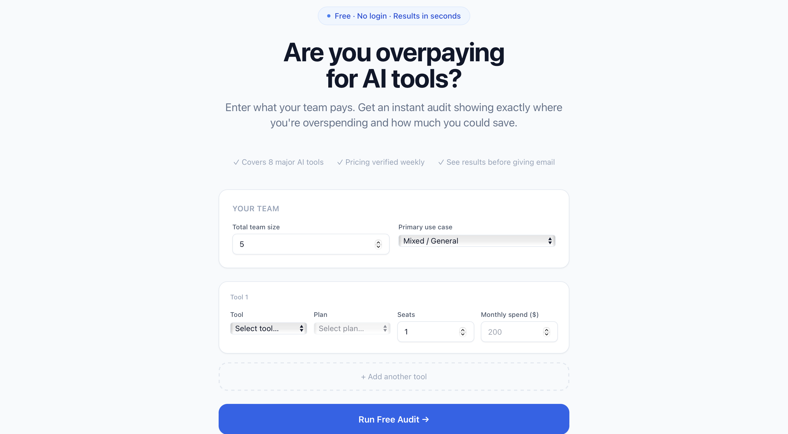
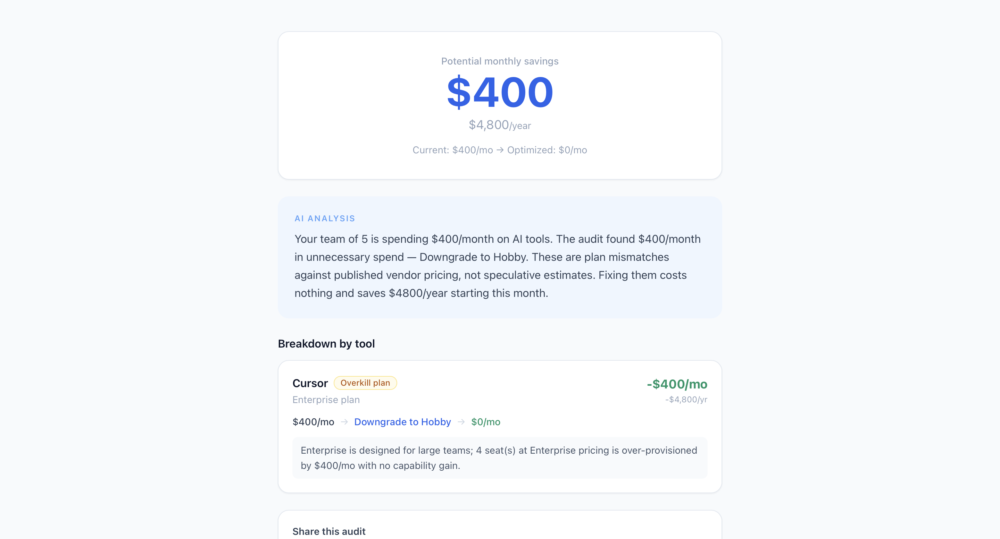
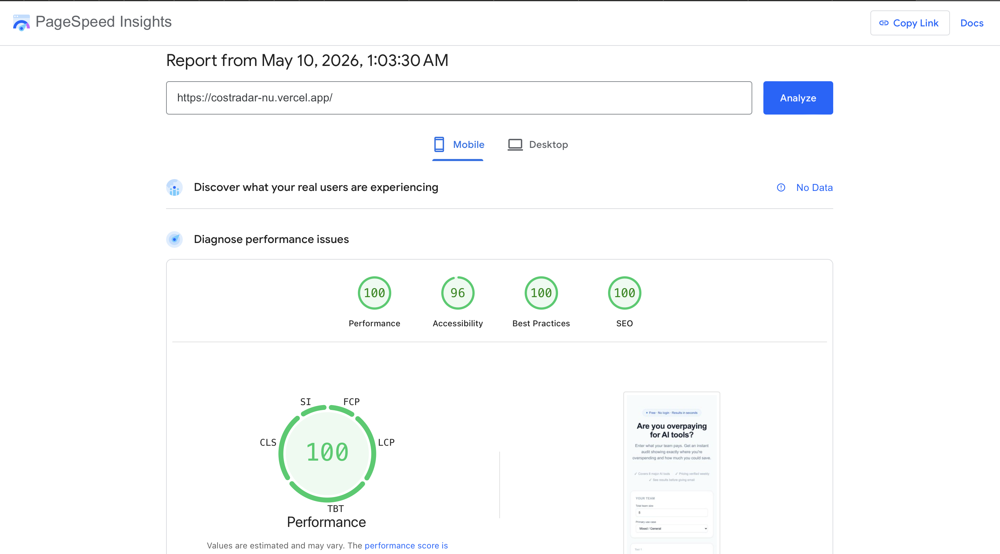

# CostRadar

People today are trying out many AI tools — Cursor, ChatGPT, Claude, 
Copilot — but finding the right one takes time that most teams simply 
don't have. The result is that people end up paying for tools that 
don't fit their workflow, or running multiple overlapping subscriptions 
without ever questioning the bill.

CostRadar solves this. Enter what your team pays for AI tools and get 
an instant audit showing exactly where you're overspending and what 
you should switch to. No login required to see your results.

**Live:** [costradar-nu.vercel.app](https://costradar-nu.vercel.app)  
**Repo:** [github.com/KaminiShirode/costradar](https://github.com/KaminiShirode/costradar)

---

## Screenshots

### Landing Page


### Audit Results


### Lighthouse Scores — 100/96/100/100 on mobile


---

## How It Works

1. User fills in their AI tools, plans, number of seats, and monthly spend
2. Audit engine runs instantly in pure TypeScript — no AI involved in the logic
3. Results show a per-tool breakdown with savings and a one-sentence reason for each recommendation
4. Anthropic Claude API generates a personalized 100-word summary (falls back to a template if the API is unavailable)
5. Audit is saved to Supabase and a unique shareable URL is generated
6. User enters their email — a confirmation is sent via Resend and the lead is saved to the database

The savings numbers are based on real vendor pricing that I verified 
manually on each tool's official pricing page. Every number in the 
audit engine traces back to a source URL documented in PRICING_DATA.md. 
The logic is hardcoded rules, not AI guessing, so anyone can read a 
recommendation and verify it themselves.

I tested the full flow with 3 real people — they filled the form, 
reviewed their results, and received the confirmation email to their 
Gmail. Everything worked end to end on the live URL.

---

## Quick Start

```bash
git clone https://github.com/KaminiShirode/costradar
cd costradar
npm install
cp .env.example .env.local
# Fill in your Supabase, Resend, and Anthropic keys
npm run dev
```

Run tests:
```bash
npm run test
# 13 tests, all passing
```

Supabase tables — run this in the SQL editor:

```sql
create table audits (
  id                    uuid default gen_random_uuid() primary key,
  created_at            timestamptz default now(),
  tools                 jsonb not null,
  team_size             int,
  use_case              text,
  total_monthly_spend   numeric,
  total_monthly_savings numeric,
  total_annual_savings  numeric,
  recommendations       jsonb,
  show_credex           boolean,
  is_already_optimal    boolean,
  ai_summary            text
);

create table leads (
  id              uuid default gen_random_uuid() primary key,
  created_at      timestamptz default now(),
  audit_id        uuid references audits(id),
  email           text not null,
  company_name    text,
  role            text,
  team_size       int,
  monthly_savings numeric
);
```

---

## Stack

| | |
|---|---|
| Framework | Next.js 14 (App Router) |
| Language | TypeScript |
| Styling | Tailwind CSS v3 |
| Database | Supabase (Postgres) |
| Email | Resend |
| AI Summary | Anthropic Claude API |
| Deploy | Vercel |
| Tests | Vitest — 13 tests covering the audit engine |
| CI | GitHub Actions — runs lint and tests on every push to main |

---

## Decisions

**1. Hardcoded audit logic, not AI**
The audit engine is pure TypeScript rules with no LLM involved. I wanted the savings numbers to be verifiable — a finance person should be able to read any recommendation and check it against the vendor's pricing page. AI is only used for the 100-word narrative summary where some variation in output is acceptable.

**2. Email captured after results, never before**
The full audit is shown first and the email is asked for afterwards. Every lead we capture has already seen their savings number, which means they're genuinely interested. Gating value behind an email form before showing anything produces lower quality leads and worse conversion.

**3. Honeypot and rate limiting instead of CAPTCHA**
The target audience is developers and engineering managers who find CAPTCHAs frustrating. A hidden honeypot field catches most automated submissions silently. IP-based rate limiting at 5 requests per hour handles brute force attempts. This approach gives better UX for real users with acceptable security for an MVP.

**4. Server component for the shareable audit page**
The `/audit/[id]` page is a React Server Component so Open Graph meta tags are generated server-side at request time. This is required for Twitter and LinkedIn link previews to work correctly. A client-rendered page would show a blank preview card to social media crawlers.

**5. Supabase over a self-hosted Postgres**
Supabase's free tier handles the scale of an MVP comfortably. The built-in table view lets Credex see and export leads without needing a custom admin panel. The typed JS SDK reduces the chance of runtime errors on database operations.

---

## What I Learned Building This

Working on this project taught me things I wouldn't have picked up from tutorials. Tailwind v4 doesn't work with Next.js 14 and switching back to v3 required rewriting the PostCSS config from scratch. Supabase recently introduced two API key formats and the JS SDK still needs the legacy anon key, not the new publishable one. Vercel runs strict TypeScript checks on build that local development doesn't always catch, which caused several failed deployments before I understood what was happening. Next.js App Router server components turned out to be the only correct way to get Open Graph tags working for social link previews.